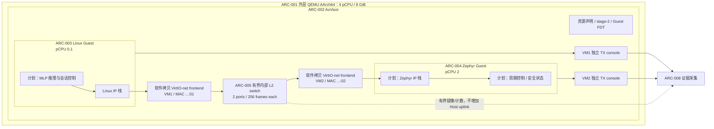
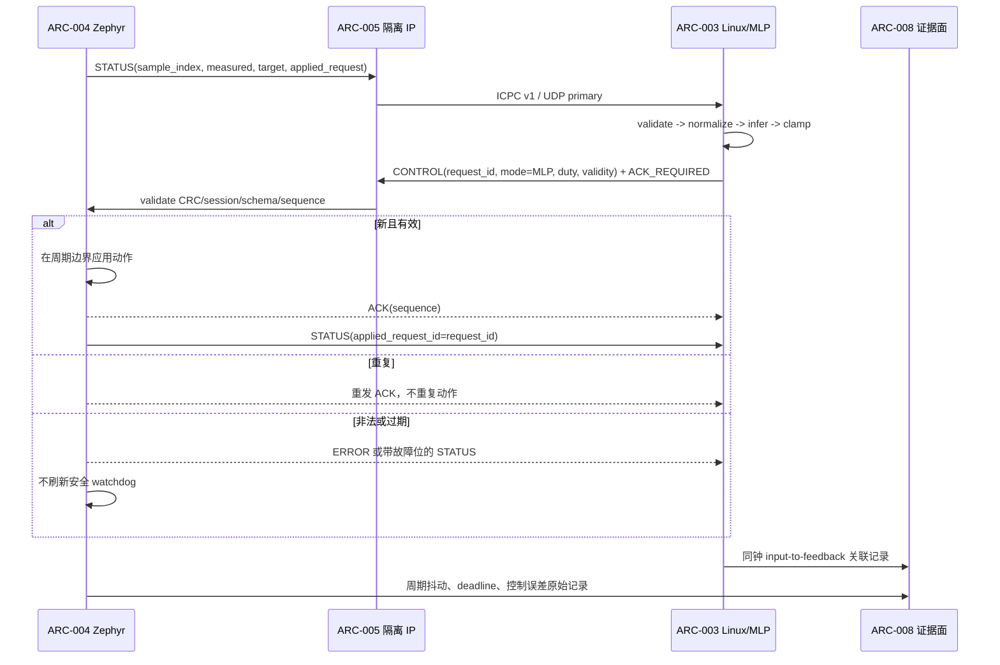

# 竞赛系统架构基线

状态：v1 设计已冻结；`DEC-010` 已把官方 axvirtio/device-graph 路线设为 P4 生产基线，迁移和端到端运行证据未完成（2026-08-17）
适用范围：`QEMU AArch64 + AxVisor + Linux + Zephyr` 竞赛主线
需求入口：[`requirements.md`](requirements.md)
接口入口：[`contracts.md`](contracts.md)
决策入口：[`sources-and-decisions.md`](sources-and-decisions.md)

本文把申报材料中的“同平台混合系统、IP 联动、AI 闭环、实时优化”落实为可分工的组件和边界。它不把设计或静态配置写成运行成果。开发者开始修改前还必须阅读 [`contest-developer-guide.md`](../contest-developer-guide.md) 中对应工作包；完成后按 [`test-matrix.md`](test-matrix.md) 和 [`deliverables.md`](deliverables.md) 交付证据。

## 1. 状态词与阅读规则

| 状态词 | 含义 | 允许的结论 |
|---|---|---|
| `implemented` | 生产代码或配置已经存在 | 只能说明实现存在，不能自动说明运行通过 |
| `static-contract` | 有静态校验或主机侧测试 | 只能说明结构/协议合同通过 |
| `runtime-evidence` | 有身份和原始日志绑定的目标环境运行包 | 只说明该证据包覆盖的环境和场景 |
| `design-frozen` | v1 唯一实现选择和数值已经确定 | 可以据此开发；未实现、未测试前不得称能力完成 |
| `planned` | 已指定 owner、路径和完成定义，但尚未实现 | 不得写成现有能力 |
| `blocked` | 前置安全门未关闭 | 不得通过放宽校验或删除负例绕过 |

所有 `ARC-*` 是稳定的架构组件 ID。重命名目录不能改变 ID；拆分或合并组件必须更新需求追踪、接口、测试矩阵和交付清单。

## 2. 系统上下文

图中是 `DEC-007` 冻结后的目标设计，不是当前运行事实。两块 NIC 都由 AxVisor 软件模拟：frontend 只通过当前 VM 的受控 Guest-memory accessor 复制 virtqueue 数据，Host-owned switch 在两个固定端口间转发完整以太帧；不存在 outer-QEMU VirtIO-net passthrough、共享 Guest 页面或 Host 网络 uplink。当前仓库仍保留旧的 outer-QEMU hub/slot 静态配置，必须在实现 P4 runnable profile 时移除其两个 `-netdev hubport` 和 `virtio-net-device` 参数，不能把旧配置当成该设计已经实现。

P2 的 `MapReserved + outer virtio-blk` 只属于 disposable 单 Linux、单设备、单请求的窄字节效果观察。它既不是双 Guest 生产存储方案，也不是 P4 网络实现的 DMA 基础，更不能推广为 VirtIO-net 或通用 DMA isolation 证据。

### 2.1 固定范围与受控偏差

- 当前可交付主线采用 Linux，而 StarryOS 是后续加分路线，见 `DEC-001`。
- 当前 RTOS 主线采用 Zephyr；申报材料优先描述的 RT-Thread 以及 FreeRTOS 留作可移植性增强，见 `DEC-002`。
- `DEC-003` 已冻结 v1 工程设计只实现 QEMU AArch64；RISC-V 与开发板不进入 v1 关键路径。最终对外如何解释相对申报路线的裁剪仍须项目负责人签字，AArch64 证据不得代表 RISC-V 或板卡。
- 申报材料名称 `ICCP` 与仓库已经实现的 `ICPC v1` 通过字段映射保持需求可追踪，不宣称二者字节布局相同，见 `DEC-004` 与 `IF-006`。
- UDP 是主传输，TCP 是有界回退；共享内存、HyperCall、裸 MMIO、vsock 和 console 均不得替代 Guest 间 IP 主链路，见 `DEC-005`。
- 安全依赖顺序覆盖原日期排期：先关闭 DMA/console/双 Guest 门禁，再取得 IP、AI、综合压力证据，见 `DEC-006`。
- `DEC-007/010` 的 v1 唯一路线已冻结为基于官方 `axvirtio-common`/`axvirtio-net`、scoped `DmaGrant` 和 device graph 的 AxVisor 软件拷贝 mediated VirtIO-net；禁止 outer VirtIO-net slot passthrough。官方 ArceOS 双 Guest demo 不是本项目 Linux+Zephyr evidence。
- `DEC-008` 的 MAC/IP/端口、应用 payload、温度 plant、控制周期、固定 PI 基线和 MLP 已冻结为 `contracts.md` 中的唯一 v1 值；所有这些均是 `design-frozen`，不是运行成果。

## 3. 组件目录

| ARC-ID | 组件与职责 | 工程 owner | 当前状态 | 依赖 | 现有路径 | 计划路径 |
|---|---|---|---|---|---|---|
| `ARC-001` | 外层 QEMU 执行环境：提供 4 个 pCPU、8 GiB 和 AxVisor 执行容器；v1 P4 不提供 outer NIC | 平台/运行负责人 | 旧拓扑 `static-contract`；目标 runnable profile `planned` | QEMU、AArch64 镜像、可复现 runner | `configs/contest/qemu-aarch64-linux-zephyr-dual.toml` 仍含将被移除的 outer NIC | 移除两个 outer netdev/device 后的配置；`scripts/contest/run_dual_guest_smoke.py` |
| `ARC-002` | AxVisor：VM 生命周期、CPU/内存/设备声明、stage-2、Guest FDT 与 console 隔离 | Hypervisor 负责人 | 部分 `implemented`；双 Guest runtime `blocked` | `ARC-001`、安全配置 | `os/axvisor/`、`virtualization/axvm/`、`virtualization/arm_vcpu/`、`virtualization/axdevice/` | 实时路径改造位于原 crate，不新建旁路 hypervisor |
| `ARC-003` | Linux 智能计算 Guest：网络会话、MLP 推理、控制命令和闭环指标 | Linux/AI 负责人 | VM 配置 `static-contract`；应用 `planned` | `ARC-002`、`ARC-005`、`ARC-006` | `os/axvisor/configs/vms/qemu/aarch64/linux-smp2-dual.toml` | `apps/contest/linux-ai-controller/` |
| `ARC-004` | Zephyr 实时控制 Guest：周期任务、对象仿真、动作应用、状态反馈和失联安全状态 | RTOS/控制负责人 | VM 配置 `static-contract`；网络/控制应用 `planned` | `ARC-002`、`ARC-005`、`ARC-006` | `os/axvisor/configs/vms/qemu/aarch64/zephyr-smp1-dual.toml` | `apps/contest/zephyr-control/` |
| `ARC-005` | 软件拷贝 mediated VirtIO-net `vnet0`：两块 VM-local frontend、scoped guest-memory copy 和有界内部 L2 switch | 虚拟化网络负责人 | `migration-required`；旧候选 host/target 已过但 r41 无 Guest-IP | `DEC-007/010`、`IF-001`、`IF-002` | 旧候选位于 `virtualization/axdevice/src/virtio_net/`；官方 `dev` 已有 `virtualization/axvirtio-common/`、`virtualization/axvirtio-net/` 与 `os/axvisor/src/virtio_net.rs` | 先完成 P4-UPSTREAM-01，再仅保留官方 crate/device-graph/DmaGrant 路径和竞赛 adapter/policy |
| `ARC-006` | Guest 间通信：UDP/TCP/IP、ICPC 线格式、可靠性状态机和应用 schema | 协议负责人 | ICPC C99 host 合同 `implemented`；Guest IP `blocked` | `ARC-005`、`DEC-004/005/008` | `scripts/contest/icpc/`、`development/contest/contest-icpc-protocol.md`（仓库镜像同名） | 两 Guest 适配层与网络 runner |
| `ARC-007` | 冻结温度 plant 上的 AI 控制闭环：100 ms Zephyr plant/控制与 Linux 决策、固定 PI 对照和 `3→8→1` MLP | AI 与控制负责人共同负责 | `design-frozen/planned` | `ARC-003`、`ARC-004`、`ARC-006` | 无生产应用；开发导航中仅有工作包 | 两个 `apps/contest/` 应用及模型/数据清单 |
| `ARC-008` | 测量与证据面：实时、网络、闭环、故障和生命周期数据的采集、绑定、复算 | 验证负责人 | 多个底层 validator 已有；端到端采集 `planned` | 所有被测组件 | `scripts/contest/`、`scripts/test/`、`results/baseline/` | `scripts/contest/rt/`、`network/`、`qualification/` |
| `ARC-009` | 构建与交付面：私有比赛仓库、干净构建、版本/哈希、文档、演示、许可和离线 patch/commit 审查包；禁止 PR | 交付负责人 | 目标仓库已创建；官方历史 mirror、提交拆分和最终包 `planned` | `ARC-008` 的合格证据 | `.github/workflows/ci.yml`、`scripts/test/check_ci_paths.py`、`contest-repository-submission.md` | 以 `deliverables.md` 为唯一交付清单 |

“工程 owner”是角色，不表示已有独立人员。单人团队可以兼任，但每次交接仍要按角色说明当前修改和下一个接手点。

## 4. 资源与职责分区

### ARC-001：执行环境

- 外层机型固定为 QEMU `virt`、Cortex-A72、GICv3、4 vCPU、8 GiB；这些是当前静态拓扑配置事实。
- P4 runnable profile 不创建任何 outer-QEMU `-netdev` 或 `virtio-net-device`；旧配置中的 `hubid=0`、slot 1/2 和两个 MAC 只是被替代的历史静态方案。Guest 间数据只经过 AxVisor 内部 switch，防止 Host/QEMU backend 获得 Guest ring 的 DMA 路径或测试流量离开系统。
- P2 disposable 单 Linux probe 可以单独创建 outer virtio-blk 与 `MapReserved` 区，但其配置、rootfs、nonce、guard 和证据目录不得进入或复用为 P4 双 Guest profile。双 Guest Linux 启动所需存储仍须按自己的工作包验证；网络设计不替它作出 DMA 结论。
- 外层进程、镜像、QMP peer、PID/start-time、启动 nonce 和命令行必须进入同一个 evidence session。静态 TOML 本身不证明 QEMU 或任一 Guest 启动。
- runner 必须有界退出并清理自己创建的进程；不得误杀身份不匹配的既有 QEMU。

### ARC-002：AxVisor 与资源所有权

- Linux VM1 固定拥有 pCPU `[0,1]`；Zephyr VM2 固定拥有 pCPU `[2]`；pCPU 3 留给 Host 和 console drain。任何重叠或数量不一致都 fail closed。
- Linux 当前使用 256 MiB identity-mapped RAM（GPA `0x8000_0000`）；Zephyr 当前使用 128 MiB `MapAlloc` RAM（GPA `0x4000_0000`）。mediated NIC 不要求 GPA=HPA：它只经每个 VM 自己的 stage-2/region 校验 accessor 做 CPU copy，并永不向 outer device 暴露 Guest 地址。
- Host PL011、ITS 和不属于该 VM 的 VirtIO slot 必须从 Guest FDT 中删除。每个 VM 的 `0x0900_0000` console 是 VM-local、TX-only、polling 的 emulated PL011，不拥有 HPA、物理 IRQ、RX 或 DMA 能力。
- `DeviceBuildContext` 在 v1 增加两个受控能力：当前 VM 专属、可克隆且绑定 generation 的 Guest-memory accessor，以及 AxVisor 本次启动专属的共享 mediated-switch handle。accessor 只暴露 checked `read(gpa, dst)`/`write(gpa, src)`，按页验证当前 VM region、方向和溢出；不得返回裸 HPA、宿主指针或另一 VM accessor。
- `VirtioNetFactory` 每次 build 创建一个独立 MMIO register bank、RX/TX split virtqueue 状态、IRQ line、MAC、port generation 和计数器；只有 switch handle 可在两个 frontend 间共享，任何 virtqueue/IRQ/accessor 均不得共享。
- AxVisor 负责资源声明和 fail-closed，不负责 AI 策略或 ICPC 业务语义。应用协议不得被塞入 hypervisor 以绕开 Guest IP。

### ARC-003：Linux 智能计算 Guest

- Linux 必须以至少 2 vCPU 启动并能记录最终 bootargs、内存、设备、IRQ 与镜像哈希。
- Linux 的 v1 网络只发现合成的 VM-local VirtIO-net 节点（GPA `0x0a00_0200`、INTID 49、MAC `02:00:00:00:00:01`），不是 outer slot 1 passthrough；不得发现 Zephyr 节点、Host UART 或 ITS。Linux root block 是独立资源，不能由 P2 窄 probe 自动判定为双 Guest 可用。
- 计划应用持有 ICPC 会话、接收 `STATUS`、执行轻量 MLP 推理、发送 `CONTROL`、关联 `ACK/ERROR` 并生成同钟闭环指标。
- 模型、归一化参数、输入输出定义、训练/导出命令和 SHA-256 都属于运行输入；缺一项时不得把结果标为可复现 AI 推理。
- 进程崩溃、超时或模型输出非法时不得留下无限期有效的控制动作；Zephyr 的独立 watchdog 是最终安全边界。

### ARC-004：Zephyr 实时控制 Guest

- Zephyr 固定使用 1 vCPU，并保留高优先级周期任务。网络、日志和错误处理不得在该任务中进行无界阻塞。
- Zephyr 的 v1 网络只接受合成的 VM-local VirtIO-net 节点（GPA `0x0a00_0400`、INTID 50、MAC `02:00:00:00:00:02`）；它不是 outer slot 2，也不进入 passthrough/excluded ownership 二选一。当前旧配置在 factory、memory accessor、switch、FDT 与负例完成前仍应保持所有 outer VirtIO-net slot 被排除。
- 计划控制应用验证 ICPC 与业务 payload，按 `(session_id, sequence, request_id)` 去重，应用动作，回传状态，并在 500 ms 没有新有效控制时进入安全状态。
- 高优先级 plant/control tick、STATUS cadence 与 Linux 推理 cadence 均固定 100 ms；网络 RX/TX、ICPC 解析和日志在更低优先级线程执行。网络线程只把校验后的最新命令投递到有界单元素 mailbox，周期任务不等待 socket、virtqueue、日志或模型。
- 无效/重复/乱序命令、网络重连和 Linux 崩溃不能破坏周期任务；错误处理必须有界，并通过状态位或 `ERROR` 可观测。

### ARC-005：设备与网络边界

- `DEC-007` 唯一 v1 路线是 AxVisor 软件拷贝 mediated VirtIO-net `vnet0`，明确不选择 passthrough、IOMMU/SMMU、identity-RAM 或 outer QEMU hub。一次 P2 virtio-blk 观察与本网络的数据面、准入或证据没有继承关系。
- VirtIO transport/queue/parser 的唯一生产实现来自官方 `virtualization/axvirtio-common/` 与 `virtualization/axvirtio-net/`；AxVisor adapter 通过 resolved device graph、`DmaGrant`/scoped `DeviceAccess` 和 wired IRQ 注册。竞赛代码只增加固定两端口策略、配置、capture 和 Guest adapter，不复制 queue parser，也不长期保存 VM-wide memory accessor。
- 每个 frontend 只实现 VirtIO-MMIO v2、split virtqueue、RX queue 0 和 TX queue 1；queue size 固定 256，descriptor chain 最多 32 项，frame 不含 FCS且长度为 `14..1514`。v1 只协商 `VIRTIO_F_VERSION_1`、`VIRTIO_NET_F_MAC`、`VIRTIO_NET_F_STATUS`；链路 MTU 固定 1500 但不广告 `VIRTIO_NET_F_MTU`，不实现 packed ring、indirect descriptor、mergeable RX、checksum/TSO/UFO、multiqueue、control queue 或 VLAN。
- TX 必须先校验完整 readable descriptor chain 和 10-byte virtio-net header，再把最多 1514 字节以 CPU copy-in 写入 Host-owned frame；RX 只向完整 writable chain copy-out。任何一帧处理期间都不得保留 Guest slice/pointer，也不得把 VM1 accessor 用于 VM2 地址。
- 内部 switch 只有两个静态端口；每端口 Host-owned FIFO 容量固定 256 帧、每帧固定上限 1514 字节。源 MAC 必须等于端口 MAC；已知对端单播、广播和 IPv4 multicast 只送对端，未知单播、任何 IPv6、VLAN 和本端回环均丢弃并计数。无 Host uplink、学习表、动态端口、阻塞等待或无界分配；满队列采用 drop-newest，绝不覆盖已排队帧。
- switch 绑定 AxVisor run session；每次 VM/device reset 或销毁递增该端口 `u64 generation`、清空其 ingress/egress 与未完成 descriptor，并拒绝旧 generation callback/frame。used-ring 更新后才按 owning frontend 的 suppression 状态触发其独立 IRQ；任何错误都不得触发另一 VM IRQ。
- Guest FDT 由 AxVisor 从每个 VM 的 immutable resolved device graph/Auto resource 分别合成 `compatible="virtio,mmio"` 节点；MMIO/INTID 不在架构规范中硬编码。两节点声明软件 mediated 设备语义，但不产生 passthrough resource claim。final DTB、resource claim、resolved graph 和 runtime 枚举必须逐字段一致，并证明每个 Guest 只看见自己的节点。
- fail-closed 测试至少覆盖：另一 VM GPA、未映射/跨区/整数溢出地址、读写方向错误、环形或超过 32 项 descriptor chain、queue size 非 256、frame 大于 1514、stale generation、source-MAC spoof、queue overflow、reset 时在途帧以及错误 IRQ owner。实现和这些负例未通过前，状态保持 `planned/blocked`；ping 也不能替代安全合同。

### ARC-006：IP 与 ICPC

- 主链路只能是 Guest Linux 与 Guest Zephyr 的 TCP/UDP/IP。console 只用于观测，Host 代理只可用于测试注入，不能代替端到端 Guest 实现。
- `scripts/contest/icpc/` 已实现 36 字节、网络字节序的 ICPC v1 头、CRC32C、有限重试和 64 包接收窗口；当前验证等级是 host 合同，不是 Guest IP。
- v1 地址、端口、传输和业务 payload 已按 `DEC-004/005/008` 冻结，见 `IF-003..009`；它们尚未接入 Guest，不能因 `design-frozen` 写成网络运行通过。
- 线格式不提供认证、保密或抗重放安全；隔离网络是部署约束，但不能被描述成密码学安全。

### ARC-007：AI 闭环

闭环以 Zephyr 状态为输入、Linux 推理为决策点、Zephyr 为动作和安全执行点：

- v1 只采用 `IF-008` 的一阶温度 plant：Zephyr 与 Linux 都按 100 ms cadence；固定 PI 与 `3→8(ReLU)→1(sigmoid)` float32 MLP 是唯一两种实验 controller。MLP 输入固定为 `{measured_mC,target_mC,previous_duty_q16_16}`。禁止把训练标签公式、固定 PI 或查表伪装成神经网络推理。
- 网络传送的是量化后的控制值与版本/请求身份；模型只在 Linux 内执行，不把模型运行时引入 Zephyr 的高优先级任务。
- 冻结对照场景为 180 s、初始/环境 25,000 mC、固定目标 55,000 mC；60–90 s 每 tick 加入 `-150 mC` disturbance。固定 PI 与 MLP 分别用 seeds `7/19/43`，并使用相同 plant、网络、目标和采样窗口。必报 RMSE、IAE、settling time、overshoot 和 Linux 同钟闭环 RTT；只有实测满足测试矩阵才能声称改善。
- 网络闭环未取得双 Guest 证据前，Linux/Zephyr 的本地单元演示只能分别报告，不得拼接成端到端成果。

### ARC-008：测量与证据面

- 控制/实时指标优先在产生事件的同一端点用单调纳秒时钟记录；ICPC 头中的毫秒时间戳只用于日志关联，RTT 由发送端本地 send/ACK-receive 事件计算，二者都不得用于跨 Guest 单向延迟。
- P3 在改生产语义前固定采集原生、AxVisor 空载与 Linux/网络/AI 压力基线；候选瓶颈只有在 3 个配对 run 中 P99.9 相对原生/关闭态均恶化至少 15%，或绝对额外延迟均至少 20 us，才可进入改造。若多个候选达标，按 P99.9 相对差排序，只选最多 2 条 timer/IRQ/vCPU/锁路径；不达门槛就报告“未选出”，不得为满足计划强造优化。
- 原始事件、Guest 日志、抓包、构建清单、配置、模型和派生统计必须被 session manifest 逐字节绑定。摘要必须能从原始 CSV/JSON(L) 重新生成。
- `status.json` 最后写入；失败运行同样保留，标为 `failed-attempt`，不能被后续成功包覆盖。
- 证据等级逐级提升：静态合同 → host 测试 → AArch64 构建 → single-Guest runtime → dual-Guest runtime → 30 分钟/长稳 → Guest IP → AI 闭环。报告不得跨级推断。

### ARC-009：构建与交付面

- CI 负责可移植的静态/host 合同；正式 AArch64 构建、QEMU runtime 和长稳由有明确环境清单的 runner 负责。
- 交付包必须能从干净 clone 复建，且区分仓库可提交摘要与本地 ignored 原始 evidence。
- 最终审查以 `requirements.md` 的 `REQ-*` 覆盖、`test-matrix.md` 的结果和 `deliverables.md` 的清单为准；演示视频不能替代原始日志和机器可读结果。

## 5. 信任与故障边界

| 边界 | 受保护对象 | 允许穿越的内容 | 禁止/失败行为 | 责任 ARC |
|---|---|---|---|---|
| `TB-01` Host/AxVisor ↔ Guest | pCPU、HPA/GPA、IRQ、设备实例 | 经资源声明和过滤 FDT 授权的资源 | 重叠、未知或不完整声明时拒绝启动 | `ARC-002` |
| `TB-02` Linux ↔ Zephyr | 实时控制任务与智能计算故障隔离 | `IF-003..009` 定义的 IP/ICPC 消息 | 不允许共享内存、console 或 Host 中继替代主链路 | `ARC-003/004/006` |
| `TB-03` mediated NIC ↔ Guest RAM | Guest/Host 内存完整性 | 当前 VM accessor 对合法 virtqueue chain 的有界 CPU copy | 禁止 raw HPA/pointer、outer NIC DMA、跨 VM accessor 和未完全验证后再写 used ring | `ARC-002/005` |
| `TB-04` Linux 模型 ↔ Zephyr actuator | 动作范围、时效性和安全状态 | 经 schema、范围、序号和有效期校验的控制值 | 非法、陈旧或失联时不应用，并在 500 ms 内安全化 | `ARC-004/007` |
| `TB-05` 被测系统 ↔ 证据/报告 | 原始事实和结论边界 | 绑定身份、哈希和时钟语义的数据 | 缺原始数据、跨会话拼接或 status 非 success 时不得晋级 | `ARC-008/009` |

## 6. 典型故障与恢复责任

| 故障 | 必须行为 | 恢复条件 | 禁止的结论 |
|---|---|---|---|
| Linux VM/控制进程退出 | Zephyr 周期任务继续；500 ms 内输出归零并置安全状态 | Linux 新进程使用新 `session_id`，首个有效新命令后显式退出安全状态 | “AI 闭环持续可用” |
| Zephyr deadline miss | 计数并保留原始时间；不得由日志线程阻塞加剧 | 周期任务继续或 fail-safe；在状态中暴露 miss | 没有原始样本时声称实时性通过 |
| UDP ACK 丢失/重复/乱序 | 通用 ICPC 保留 100/200/400 ms、最多三次重传；CONTROL 到 500 ms 有效期必须取消尚未发生的重传并安全化 | 匹配 ACK，或旧 UDP session 失效后以新 session 有界切换 TCP | 700 ms 后继续重发已过期 CONTROL、无限重试或静默成功 |
| CRC/schema/范围错误 | fail closed，不刷新 watchdog，不改变 actuator | 后续独立有效新消息 | 把错误注入包计入成功控制 |
| mediated NIC 尚未实现或负例未过 | 所有 outer NIC slot 保持排除，运行入口返回 blocked；不得恢复 passthrough 应急 | factory、accessor、switch、合成 FDT、descriptor/隔离负例和绑定 runtime 全部通过 | ping、旧 hub 配置或 P2 block probe 等于 mediated network 完成 |
| switch queue 满或 stale generation | drop-newest/拒绝旧事件，计数并保持另一 VM 内存与 IRQ 不变 | 新 generation 正常队列和显式健康状态 | 覆盖旧帧、跨 reset 投递或无界扩容 |
| 单一传输失效 | 停止该 session；按 `IF-004` 建立互斥的新 transport session | 新 session 建立并重新通过健康检查 | UDP/TCP 同时控制同一 actuator |
| evidence 不完整或 cleanup 失败 | 写失败状态、保留全部可得工件、报告 primary 与 cleanup 错误 | 新 evidence 目录重新执行 | 从部分日志拼成成功包 |

## 7. 开发变更规则

1. 先在 `traceability.md` 找到需求，再确定 `ARC-*` owner 和对应 `IF-*`。
2. 改变 CPU、内存、设备、IP、端口、线格式、payload 或 500 ms 安全超时时，必须先更新相应 `DEC-*`，不能直接改代码形成第二套事实。
3. 生产改动只进入组件表列出的路径；测试 runner/validator 进入 `scripts/contest/` 与 `scripts/test/`，原始证据进入新的 `results/baseline/runs/` 目录。
4. 跨组件变更必须至少由发送端、接收端、负例 validator 三方合同共同失败后再共同转绿。
5. 若实现状态与本文冲突，以可复核源码/配置和最新 evidence 为事实，并立即把本文状态降级或提请决策；不得修改报告文字掩盖差异。
